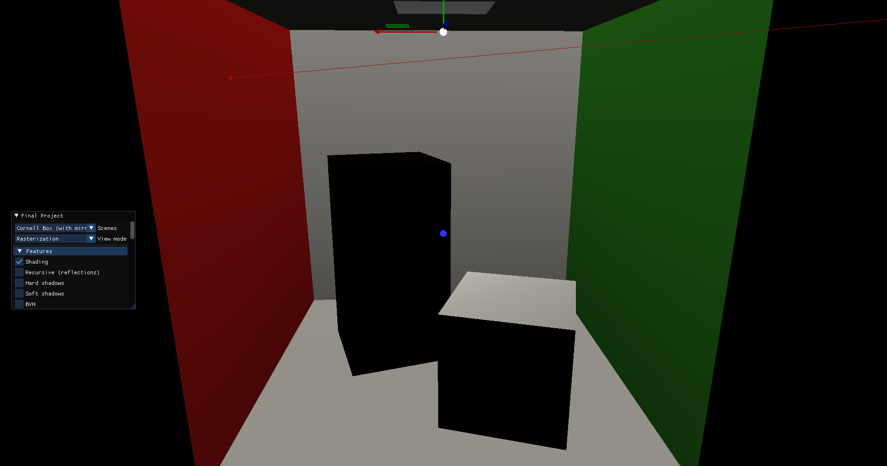

# CG Final Project Report

Kazek Ciaś 5467640
Renyi Yang 5470668
Toma Volentir 5454123
Group number: 62

---

## Work Distribution

Reflected in "final-project-workload-final.xlsx"

---

## Basic Features

### Shading

**Implementation**

Following the Phong Model, shading is calculated using the diffuse and specular terms. If shading is disabled, then the 
diffuse color (kd) is returned. The light contribution in the scene is calculated over all light sources and depends on 
the type of light (point/segment/parallelogram). The resulting color is the average over all light sources.

**Examples**

|  |  |
|-----------------------------------------------------|-------------------------------------------------|
| _Monkey without shading_                            | _Monkey with shading_                           |

|  |  |
|-----------------------------------------------------|----------------------------------|
| _Teapot without shading_                            | _Teapot with shading_            |

**Visual Debug**

The ray takes the calculated shading color of the object that it hits.

|  |  |  |
|-------------------------------------------------------|------------------------------------------------------|--------------------------------------------------------|
| _Gray ray in Cornell box_                             | _Red ray in Cornell box_                             | _Green ray in Cornell box_                             |


### Recursive ray-tracer

**Implementation**

In the getFinalColor() method, if recursion is enabled, we can obtain mirror-like surfaces, as long as the materials hit 
have non-zero specular terms. If this is the case, we recursively call the method to obtain the color that is reflected
off the surface of the mirror-like object. Using the formula from the lectures ``Lo += hitInfo.material.ks * reflectedColor``,
where ``Lo`` is the final color, we can see the reflections from the mirror object!

**Examples**

|  |  |
|----------------------------------------------------------|-----------------------------------------------------------|
| _Cornell box with shading_ and no _recursion_            | _Cornell box with shading_ and _recursion_                |

**Visual Debug**

Similar to shading's visual debug, the ray takes the final colour of the object that it hits, this time including any
potential reflections off surfaces.

|  |  |  |
|--------------------------------------------------------------|------------------------------------------------------------|---------------------------------------------------|
| _Gray reflection off wall_                                   | _Red reflection off wall_                                  | _No hit, black reflection_                        |


### Hard shadows

**Implementation**

A ray is shot from all intersection points to each point light; if it intersects geometry before the light the point
is marked as in shadow. Then the color determined by the shading function is multiplied by the average color
of all lights that reach the sampled point.

**Examples**

|  |  |
|---------------------------------------------------|---------------------------------------------------------------|
| _Single white light_                              | _Two colored lights_                                          |

### Area lights

**Implementation**

A number of samples are taken randomly from the light, using linear (for segment lights) or bilinear (for area lights)
interpolation to determine the color. Then the samples are checked for visibility (see [Hard Shadows](#hard-shadows))
and averaged together.

**Examples**

|  |  |
| -------------------------------------- | -------------------------------- |
| _Segment light_                        | _Area light_                     |

### BVH generation

### BVH traversal

**Implementation**

Using an iterative BFS algorithm implemented using a priority queue (instead of a normal queue) which holds indexes in
the data structure, the BVH traversal goes through each level of the acceleration data structure checking for 
intersections with AABBs (if internal node) or primitives (if leaf node). It keeps (and continuously updates) a minimum 
value for ``ray.t``. This way it knows whether to visit the nodes that it intersects (if ``ray.t < minRayT`` then the 
node is worth checking, otherwise the node is further away from the nearest primitive intersection). 

To motivate the use of the priority queue, it seems that using a normal queue rarely, if at all (think 1:100), find 
intersected nodes that will not be visited (this means that using a queue mostly evaluated nodes starting from the 
farthest to the closest; this is bad because it means it checks all the nodes instead of discarding some of them). 
The priority queue performs better in this manner and actually finds and "discards" intersected but not visited nodes
(see visual debug).

**Examples**

For clarity: The first render time is _without_ BVH enabled, the second render time is _with_ BVH enabled.
The render times decrease proportionally to the number of triangles/primitives. The more complex the object/image, the 
better BVH performance!

|  |  |
|------------------------------------------------------------------------|------------------------------------------------------------------------|
| _Dragon render times - from 5 minutes to 7 seconds!_                   | _Teapot render times_                                                  |


**Visual Debug**

When shooting a ray, (_only_) intersected nodes are visualized with the color white. The final primitive hit is also drawn in 
white. This is visible in the 4th example.

Nodes that are intersected but not visited are visualized with the color red. This option can be turned on/off by
checking a box (the "Draw intersected but not visited nodes with a different colour" flag) in the Debugging section of 
the menu in OpenGL. This feature is best seen in examples 2 and 4.

|  |  |
|----------------------------------------------------|----------------------------------------------------|
| _Example 1 - left ear hit_                         | _Example 2 - right side of head hit_               |
|  |  |
| _Example 3 - no primitive hit_                      | _Example 4 - drawn primitive_                      |


### Normal interpolation

**Implementation**

Normal is calculated using barycentric coordinates obtained in intersection and later used in shading and reflections.

**Examples**

|  |  |
| --------------------------------------- | ---------------------------------- |
| _Without interpolation_                 | _With interpolation_               |

### Texture

---

## Extra Features

### Environment maps

### SAH+binning

### Motion blur

### Bloom filter

### Bilinear interpolation

### Mipmapping

### Irregular sampling

### Glossy reflections

**Implementation**

When taking reflection samples, instead of taking just one, a number (controlled by the user) of samples is taken,
and each sample's direction is offset by a uniformly distributed point on a circle perpendicular to the direction
with radius `1/shininess`. All samples with direction away from the mesh (`direction · normal > 0`) are then averaged
to determine the final result.

**Example**


### Transparency

**Implementation**

When a sample ray hits a transparent surface, shading is calculated for the intersection point, a new sample is taken
in the same direction from the intersection and both results are combined using alpha blending.

This is done both for direct samples and shadow rays; `testVisibilityLightSample` has been modified to return
a `glm::vec3` indicating the colour of the shadow (which is later combined with the colour ofthe light).

Additionally, an option for translucency has been added: similar to [glossy reflections](#glossy-reflections),
instead of taking one sample when hitting a transparent surface, a number of randomly offset samples is taken.
The number of samples is controllable with a slider in the GUI.

**Examples**

For the following images the _Cornell Box_ scene was modified by replacing the small box's default material with this:

```mtl
newmtl shortBox
Ns 10.000002
Ka 1.000000 1.000000 1.000000
Kd 0.3000 0.710000 0.680000
Ks 0.000000 0.000000 0.000000
Ke 0.000000 0.000000 0.000000
Ni 1.000000
d 0.200000
illum 1
```

|  |  |  |
| ------------------------------------------------- | ---------------------------------------------------- | ----------------------------------------- |
| _Transparency with point light_                   | _Transparency with area light_                       | _Translucency_                            |

### Depth of field

**TODO - im tired now lol**

---

## Models

---

## Performance test

|                       | Cornell Box | Monkey | Dragon |
| --------------------- | ----------- | ------ | ------ |
| Num triangles         |             |        |        |
| Time to create (BVH)  |             |        |        |
| Time to render (BVH)  |             |        |        |
| Time to create (SAH)  |             |        |        |
| Time to render (SAH)  |             |        |        |
| BVH levels            |             |        |        |
| Max tris p/ leaf node |             |        |        |
