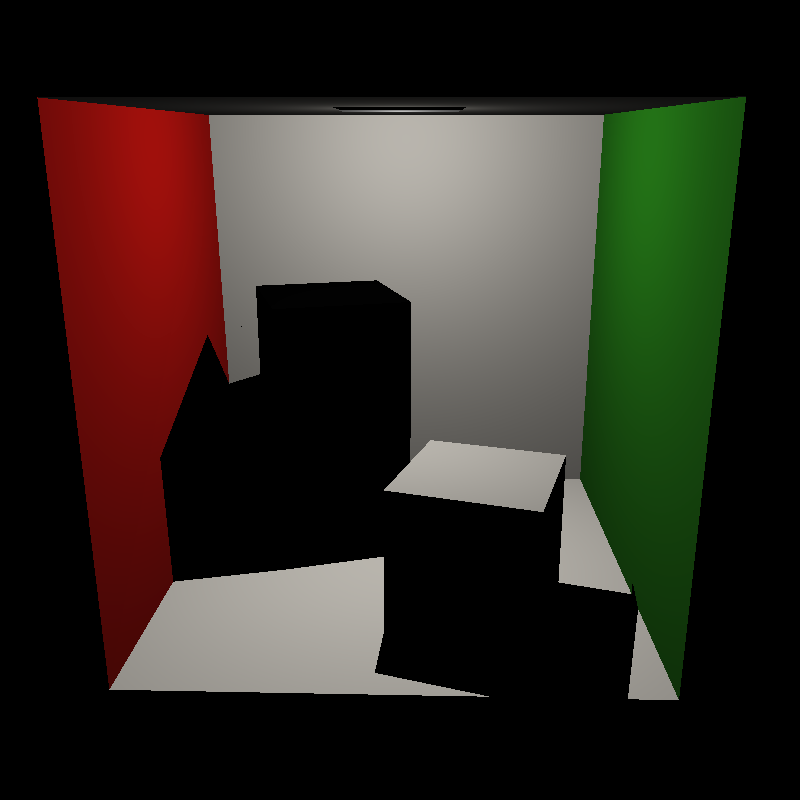
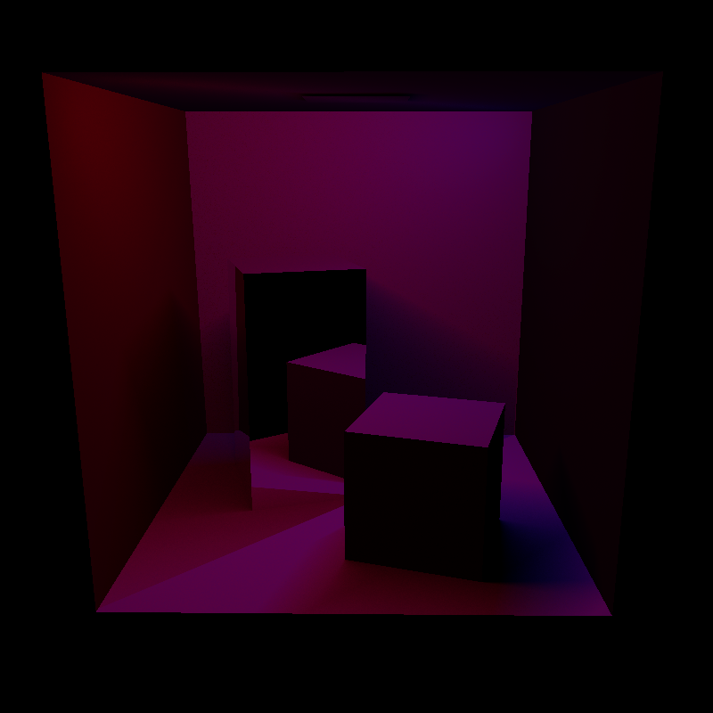

# CG Final Project Report

Kazek Ciaś 5467640
Renyi Yang 5470668
Toma Volentir 5454123
Group number: 62

## Work Distribution

Reflected in "final-project-workload-final.xlsx"


## Basic Features

### Shading

### Recursive ray-tracer

### Hard shadows

**Implementation**

A ray is shot from all intersection points to each point light; if it intersects geometry before the light the point
is marked as in shadow. Then the color determined by the shading function is multiplied by the average color
of all lights that reach the sampled point.

**Examples**

|  |  |
| ------------------------------------------------- | ------------------------------------------------------------- |
| _Single white light_                              | _Two colored lights_                                          |

### Area lights

**Implementation**

A number of samples are taken randomly from the light, using linear (for segment lights) or bilinear (for area lights)
interpolation to determine the color. Then the samples are checked for visibility (see [Hard Shadows](#hard-shadows))
and averaged together.

**Examples**

|  |  |
| -------------------------------------- | -------------------------------- |
| _Segment light_                        | _Area light_                     |

### BVH generation

The `Node` structure is designed according to the assignment requirement, I use 4 indexes to locate a triangle, `TriangleCoordinate = (meshIndex, vertexIndex1,vertexIndex2,vertexIndex3)`.when a bvh tree is created,  it goes through all the triangles and store the triangle coordinates in a vector, then it will be used in method `treeConstruction` which means to fill the global variable `tree`.

`treeConstruction` is a recursive function, at each layer the current node is generated according to the triangles it contains, then spilt the triangles in the middle and has the recursive calls for the next layer(if needed).

parameter `maxdepth` can be adjusted to control for the final shape of the `tree`, for default it's set to 10.

The effect of the BVH cannot be shown in the rendered image because it doesn't influence the appearance of the scene, but the improvement of the render speed is present in the "performance test" block.
|  |  |
| :----------------------------------------: | :--------------------------------------: |
|     AABBs for BVH nodes with level = 5     |       4th leaf of the cornell box        |


### BVH traversal

### Normal interpolation

**Implementation**

Normal is calculated using barycentric coordinates obtained in intersection and later used in shading and reflections.

**Examples**

|  |  |
| --------------------------------------- | ---------------------------------- |
| _Without interpolation_                 | _With interpolation_               |

### Texture

---

## Extra Features

### Environment maps

Method `glm::vec3 acquireTexelEnvironment(const Image& image, const glm::vec3& direction, const Features& features)` is made to retrieve the corresponding pixel of the environmental texture given the direction of the camera.  A vector function is created to mapping normalized 3d vectors to a 2d vector (u,v) while u,v are values between 0 and 1. Then the uv coordinate is scaled according to the size of the texture and it's converted to the pixel index.

This method is called when the ray has no hit so it can create a background looking.


### SAH+binning

### Motion blur

### Bloom filter

### Bilinear interpolation

### Mipmapping

### Irregular sampling

### Glossy reflections

**Implementation**

When taking reflection samples, instead of taking just one, a number (controlled by the user) of samples is taken,
and each sample's direction is offset by a uniformly distributed point on a circle perpendicular to the direction
with radius `1/shininess`. All samples with direction away from the mesh (`direction · normal > 0`) are then averaged
to determine the final result.

**Example**


### Transparency

**Implementation**

When a sample ray hits a transparent surface, shading is calculated for the intersection point, a new sample is taken
in the same direction from the intersection and both results are combined using alpha blending.

This is done both for direct samples and shadow rays; `testVisibilityLightSample` has been modified to return
a `glm::vec3` indicating the colour of the shadow (which is later combined with the colour ofthe light).

Additionally, an option for translucency has been added: similar to [glossy reflections](#glossy-reflections),
instead of taking one sample when hitting a transparent surface, a number of randomly offset samples is taken.
The number of samples is controllable with a slider in the GUI.

**Examples**

For the following images the _Cornell Box_ scene was modified by replacing the small box's default material with this:

```mtl
newmtl shortBox
Ns 10.000002
Ka 1.000000 1.000000 1.000000
Kd 0.3000 0.710000 0.680000
Ks 0.000000 0.000000 0.000000
Ke 0.000000 0.000000 0.000000
Ni 1.000000
d 0.200000
illum 1
```

|  |  |  |
| ------------------------------------------------- | ---------------------------------------------------- | ----------------------------------------- |
| _Transparency with point light_                   | _Transparency with area light_                       | _Translucency_                            |

### Depth of field

**TODO - im tired now lol**

---

## Models

---

## Performance test

|                       | Cornell Box | Monkey | Dragon |
| --------------------- | ----------- | ------ | ------ |
| Num triangles         |             |        |        |
| Time to create (BVH)  |             |        |        |
| Time to render (BVH)  |             |        |        |
| Time to create (SAH)  |             |        |        |
| Time to render (SAH)  |             |        |        |
| BVH levels            |             |        |        |
| Max tris p/ leaf node |             |        |        |
