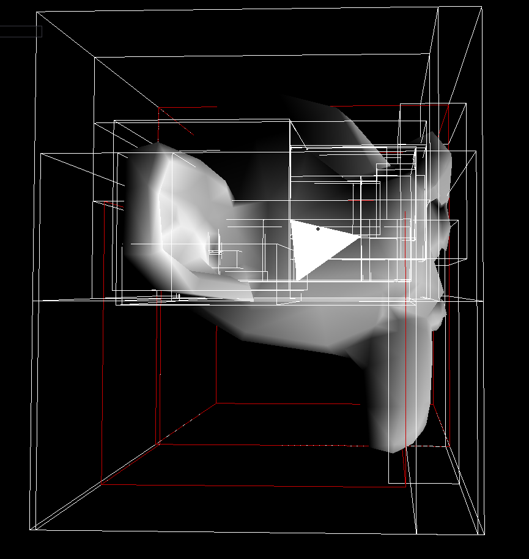
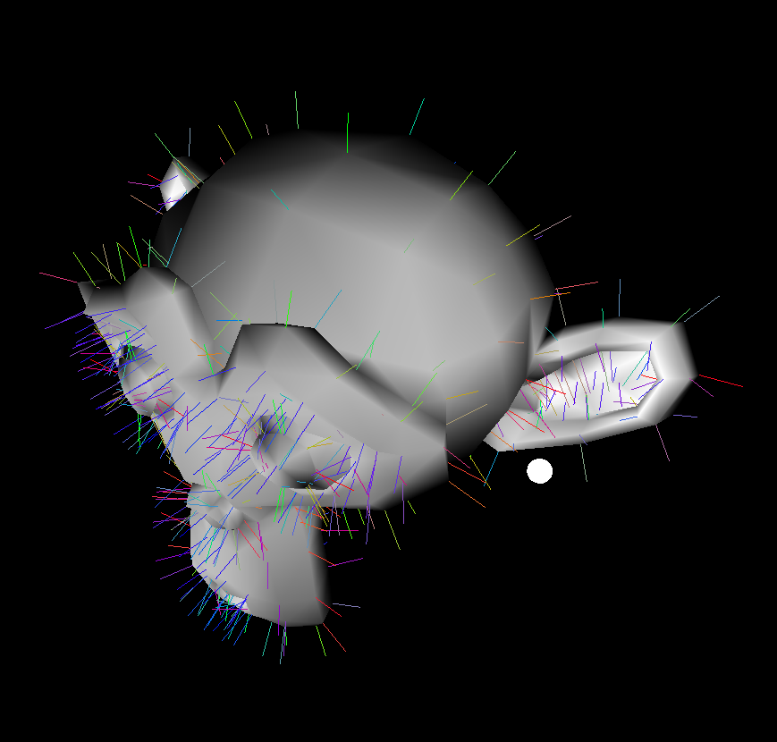

# CG Final Project Report

- Kazek Ciaś 5467640
- Renyi Yang 5470668
- Toma Volentir 5454123
- Group number: 62

We do not use the prebuilt intersection library

## Work Distribution

Reflected in "final-project-workload-final.xlsx"


## Basic Features

### Shading

**Implementation**

Following the Phong Model, shading is calculated using the diffuse and specular terms. If shading is disabled, then the
diffuse color (kd) is returned. The light contribution in the scene is calculated over all light sources and depends on
the type of light (point/segment/parallelogram). The resulting color is the average over all light sources.

**Examples**

|  |  |
| --------------------------------------------------- | ----------------------------------------------- |
| _Monkey without shading_                            | _Monkey with shading_                           |

|  |  |
| --------------------------------------------------- | -------------------------------- |
| _Teapot without shading_                            | _Teapot with shading_            |

**Visual Debug**

The ray takes the calculated shading color of the object that it hits.

|  |  |  |
| ----------------------------------------------------- | ---------------------------------------------------- | ------------------------------------------------------ |
| _Gray ray in Cornell box_                             | _Red ray in Cornell box_                             | _Green ray in Cornell box_                             |

### Recursive ray-tracer

**Implementation**

In the getFinalColor() method, if recursion is enabled, we can obtain mirror-like surfaces, as long as the materials hit
have non-zero specular terms. If this is the case, we recursively call the method to obtain the color that is reflected
off the surface of the mirror-like object. Using the formula from the lectures `Lo += hitInfo.material.ks * reflectedColor`,
where `Lo` is the final color, we can see the reflections from the mirror object!

**Examples**

|  |  |
| -------------------------------------------------------- | --------------------------------------------------------- |
| _Cornell box with shading_ and no _recursion_            | _Cornell box with shading_ and _recursion_                |

**Visual Debug**

Similar to shading's visual debug, the ray takes the final colour of the object that it hits, this time including any
potential reflections off surfaces.

|  |  |  |
| ------------------------------------------------------------ | ---------------------------------------------------------- | ------------------------------------------------- |
| _Gray reflection off wall_                                   | _Red reflection off wall_                                  | _No hit, black reflection_                        |

### Hard shadows

**Implementation**

A ray is shot from all intersection points to each point light; if it intersects geometry before the light the point
is marked as in shadow. Then the color determined by the shading function is multiplied by the average color
of all lights that reach the sampled point.

**Examples**

|  |  |
| ------------------------------------------------- | ------------------------------------------------------------- |
| _Single white light_                              | _Two colored lights_                                          |

**Visual Debug**

|                   |
| ----------------------------------------------------------------------- |
| _The color of the ray indicates transparency of the intersected meshes_ |

### Area lights

**Implementation**

A number of samples are taken randomly from the light, using linear (for segment lights) or bilinear (for area lights)
interpolation to determine the color. Then the samples are checked for visibility (see [Hard Shadows](#hard-shadows))
and averaged together.

**Examples**

|  |  |
| -------------------------------------- | -------------------------------- |
| _Segment light_                        | _Area light_                     |

**Visual Debug**

|                           |
| ------------------------------------------------------------------------------- |
| _All samples are visualised; the color of the ray again indicates transparency_ |

### BVH generation

The `Node` structure is designed according to the assignment requirement, I use 4 indexes to locate a triangle, `TriangleCoordinate = (meshIndex, vertexIndex1,vertexIndex2,vertexIndex3)`.when a bvh tree is created,  it goes through all the triangles and store the triangle coordinates in a vector, then it will be used in method `treeConstruction` which means to fill the global variable `tree`.

`treeConstruction` is a recursive function, at each layer the current node is generated according to the triangles it contains, then spilt the triangles in the middle and has the recursive calls for the next layer(if needed).

parameter `maxdepth` can be adjusted to control for the final shape of the `tree`, for default it's set to 10.

The effect of the BVH cannot be shown in the rendered image because it doesn't influence the appearance of the scene, but the improvement of the render speed is present in the "performance test" block.
|  |  |
| :----------------------------------------: | :--------------------------------------: |
|_AABBs for BVH nodes with level = 5_     |       _4th leaf of the cornell box_        |


### BVH traversal

**Implementation**

Using an iterative BFS algorithm implemented using a priority queue (instead of a normal queue) which holds indexes in
the data structure, the BVH traversal goes through each level of the acceleration data structure checking for
intersections with AABBs (if internal node) or primitives (if leaf node). It keeps (and continuously updates) a minimum
value for `ray.t`. This way it knows whether to visit the nodes that it intersects (if `ray.t < minRayT` then the
node is worth checking, otherwise the node is further away from the nearest primitive intersection).

To motivate the use of the priority queue, it seems that using a normal queue rarely, if at all (think 1:100), find
intersected nodes that will not be visited (this means that using a queue mostly evaluated nodes starting from the
farthest to the closest; this is bad because it means it checks all the nodes instead of discarding some of them).
The priority queue performs better in this manner and actually finds and "discards" intersected but not visited nodes
(see visual debug).

**Examples**

For clarity: The first render time is _without_ BVH enabled, the second render time is _with_ BVH enabled.
The render times decrease proportionally to the number of triangles/primitives. The more complex the object/image, the
better BVH performance!

|  |  |
| ---------------------------------------------------------------------- | ---------------------------------------------------------------------- |
| _Dragon render times - from 5 minutes to 7 seconds!_                   | _Teapot render times_                                                  |

**Visual Debug**

When shooting a ray, (_only_) intersected nodes are visualized with the color white. The final primitive hit is also drawn in
white. This is visible in the 4th example.

Nodes that are intersected but not visited are visualized with the color red. This option can be turned on/off by
checking a box (the "Draw intersected but not visited nodes with a different colour" flag) in the Debugging section of
the menu in OpenGL. This feature is best seen in examples 2 and 4.

|  |  |
| -------------------------------------------------- | -------------------------------------------------- |
| _Example 1 - left ear hit_                         | _Example 2 - right side of head hit_               |
|  |  |
| _Example 3 - no primitive hit_                     | _Example 4 - drawn primitive_                      |

### Normal interpolation

**Implementation**

Normal is calculated using barycentric coordinates obtained in intersection and later used in shading and reflections.

**Examples**

|  |  |
| --------------------------------------------------- | ---------------------------------------------- |
| _Without interpolation_                             | _With interpolation_                           |

**Visual Debug**

There are two (not mutually exclusive options):

1. Draw normals at vertices and intermediate points:
   |  |  |
   | ---------------------------------------------------- | ------------------------------------------------------------- |
   | _Only vertices_ | _Vertices and points in between_ |

2. Draw normals at intersection points with debug rays
   

### Texture

After the intersection point is generated, it's texture coordinates is calculated by interpolation, then the corresponding pixel is retrieved as a substitution for `hitInfo.material.kd`.

the debug ray will get color of the texture if texture mapping is enabled, we can also debug by checking the textured cube in ray-traced mode.
|  |  |
| --------------------------------------- | ---------------------------------- |
| _front 3 sufaces_                 | _back 3 surface_               |


---

## Extra Features

### Environment maps

Method `glm::vec3 acquireTexelEnvironment(const Image& image, const glm::vec3& direction, const Features& features)` is made to retrieve the corresponding pixel of the environmental texture given the direction of the camera.  A vector function is created to mapping normalized 3d vectors to a 2d vector (u,v) while u,v are values between 0 and 1. Then the uv coordinate is scaled according to the size of the texture and it's converted to the pixel index.

This method is called when the ray has no hit so it can create a background looking.
|  |  |
| --------------------------------------- | ---------------------------------- |
| _Without reflection_                 | _With reflection_               |

The debug ray is used for the visual debug, if it has no hit with the environmental mapping open, the ray supposed to have the color of the environmental texture. or it's red as default.
|  |  |
| --------------------------------------------- | --------------------------------------- |
| _Without environmental mapping_               | _With environmental mapping_            |


### SAH+binning

Now the splitting axis and boundary triangle are chosen base on the surface area heuristic. For each splitting the method `std::tuple<int, int> SurfaceAreaHeuristics(Scene* pScene,std::vector<glm::vec4>& traingleIndex)` is called, which will go through all the possible axis and bins, for each split choice, its score is calculated by $SurfaceAreaA*NumberofTrianglesA+SurfaceAreaB*NumberofTrianglesB$ (A and B  are AABBs of the splited node). And the final criteria is determined by the one that has the smallest score. All the rest part is identical to BVH.

`float getSurface(const AxisAlignedBox& boundary)`is made auxiliary for the score calculation.

The splitting plane can be drawn with AABBs, indicating where the node gets splited, for BVH all the planes towards the same direction and always near the middle of the AABB, but for SAH splitting planes vary a lot.
|  |  |
| --------------------------------------------- | --------------------------------------- |
| _BVH splitting criteria_               | _SAH splitting criteria_            |

### Motion blur

The motion direction and motion speed can be configured via the GUI, the motion direction is considered as the same with its normalized value, and the motion speed is a relative value without physical meaning. During rendering, every ray's origin will have a offset within `(0, motionspeed•motion direction)`, for each ray, we take `numberofsample=200` offsets and the mean of the color those ray hits donates the final color of the pixel. 

|  |  |
| --------------------------------------- | ---------------------------------- |
| _blured triangle(speed = 0.13) _                 | _blured monkey(speed = 0.2)_               |

For visual debug a line segment can be drawn whose direction represents the motion direction and the motion speed is reflected in the length of the segment(relative value).
|  |  |
| --------------------------------------------- | --------------------------------------- |
| _triangle motion_               | _monkey motion_            |


### Bloom filter

**Implementation**

Bloom filtering is done on the final rendered image in the ``renderRayTracing`` method in the ``render.cpp`` file.
Following the model from the lecture, only pixels with color above a certain threshold are taken for filtering 
(take a grayscale value which is represented by the highest term in RGB form: ``max(red, green, blue)``). Then, a filter 
is applied over these pixels. Instead of box filter (average of 9 pixels), as in the lecture, 2-pass gaussian filter is 
used. This method provides a better blur because of usage of weights following a gaussian distribution, as opposed to 
all pixels having the same weight (1/9) as in the box filter. 2-pass gaussian blur is better than normal gaussian blur 
in terms of performance. In the end, the original image pixel is added to the filtered pixel to obtain the bloom effect.

When enabling bloom filter in the OpenGL menu, there are 2 extra parameters which can be specified: ``threshold`` and 
``intensity``. Both have Slider GUIs ranging from 0 to 1. ``Threshold`` controls how bright pixels should be in order to be
taken into account by the filter: high threshold means less pixels taken into account, lower threshold means more pixels.
``Intensity`` controls how strong the light emission is on the filter: high intensity, stronger light emission.

Here are the sources which helped in implementing this feature:
- [Learn OpenGL Bloom](https://learnopengl.com/Advanced-Lighting/Bloom)
- [Catlike coding - unity - bloom](https://catlikecoding.com/unity/tutorials/advanced-rendering/bloom/)
- [3D Game Shaders For Beginners](https://lettier.github.io/3d-game-shaders-for-beginners/bloom.html)
- [Shadertoy](https://www.shadertoy.com/view/lsXGWn)
- [Wikipedia Box blur](https://en.wikipedia.org/wiki/Box_blur), while gaussian blur was used instead of box blur, this
source helped in the implementation.

**Examples**

Cornell Box examples

|  |  |
|-------------------------------------------|-------------------------------------------|
| _Bloom with 0 intensity_                  | _Bloom with 1 intensity_                  |

|  |  |  |
|--------------------------------------------|--------------------------------------------------|----------------------------------------------|
| _Low intensity_                            | _Medium intensity_                               | _High intensity_                             |

Dragon examples


|   |   |
|-------------------------------------------------------------|--------------------------------------------------------------|
| _Low threshold, low intensity_                              | _Low threshold, high intensity_                              |
|  |  |
| _High threshold, low intensity_                             | _High threshold, high intensity_                             |


### Bilinear interpolation

### Mipmapping

### Irregular sampling

**Implementation**

Instead of taking one sample per pixel, a jittered grid of samples is taken, which eliminates jagged edges.

**Example**

|                    |                  |
| -------------------------------------------------- | ---------------------------------------------- |
| _Notice the jagged edges without irreguar samping_ | _With irreguar sampling, the edges are smooth_ |

**Visual Debug**

|  |
| ------------------------------------------ |
| _All samples are visualised_               |

### Glossy reflections

**Implementation**

When taking reflection samples, instead of taking just one, a number (controlled by the user) of samples is taken,
and each sample's direction is offset by a uniformly distributed point on a circle perpendicular to the direction
with radius `1/shininess`. All samples with direction away from the mesh (`direction · normal > 0`) are then averaged
to determine the final result.

**Example**


**Visual Debug**

|  |
| ------------------------------------------------ |
| _All samples are visualised_                     |

### Transparency

**Implementation**

When a sample ray hits a transparent surface, shading is calculated for the intersection point, a new sample is taken
in the same direction from the intersection and both results are combined using alpha blending.

This is done both for direct samples and shadow rays; `testVisibilityLightSample` has been modified to take return
a `glm::vec3` indicating the colour of the shadow (which is later combined with the colour ofthe light).

Additionally, an option for translucency has been added: similar to [glossy reflections](#glossy-reflections),
instead of taking one sample when hitting a transparent surface, a number of randomly offset samples is taken.
The number of samples is controllable with a slider in the GUI.

**Examples**

For the following images the _Cornell Box_ scene was modified by replacing the small box's default material with this:

```mtl
newmtl shortBox
Ns 10.000002
Ka 1.000000 1.000000 1.000000
Kd 0.3000 0.710000 0.680000
Ks 0.000000 0.000000 0.000000
Ke 0.000000 0.000000 0.000000
Ni 1.000000
d 0.200000
illum 1
```

|  |  |  |
| ------------------------------------------------- | ---------------------------------------------------- | ----------------------------------------- |
| _Transparency with point light_                   | _Transparency with area light_                       | _Translucency_                            |

**Visual Debug**

|  |
| ------------------------------------------------ |
| _All samples are visualised_                     |

### Depth of field

**Implementation**

Instead of shooting one ray, a number of samples is averaged. Each sample's origin is offset by a uniformly chosen
random point on the aperture, a circle perpendicular to `camera.forward` and centered on the camera's position,
and the sample's direction is found by taking the vector from the original's vector origin to its intersection
with the focal plane and offseting it the same distance as the origin, but in the opposite direction. This causes
all samples to converge on a single point on the focal plane.

Focal length, aperture size and number of samples are user-controlled with sliders in the GUI.

**Example**

|    |
| ------------------------------------- |
| _Focal length 2.5, aperture size 0.1_ |

**Visual Debug**

|  |  |
| ----------------------------------------------- | -------------------------------------------- |
| _All samples are visualised_                    | _Aperture is also shown_                     |

---

## Models

---

## Performance test

|                       | Cornell Box | Monkey   | Dragon    |
| --------------------- | ----------- | -------- | --------- |
| Num triangles         | 32          | 968      | 87K       |
| Time to create (BVH)  | 0.0571ms    | 1.8861ms | 219.089ms |
| Time to render (BVH)  | 7.98061s    | 9.55794s | 13.3239s  |
| Time to create (SAH)  | 0.1391ms    | 5.7154ms | 885.793ms |
| Time to render (SAH)  | 2.22238s    | 3.58297s | 10.8125s  |
| BVH levels            | 5           | 10       | 10        |
| Max tris p/ leaf node | 1           | 1        | 86        |

_*all the tests is measured within one execution, in the release mode_
